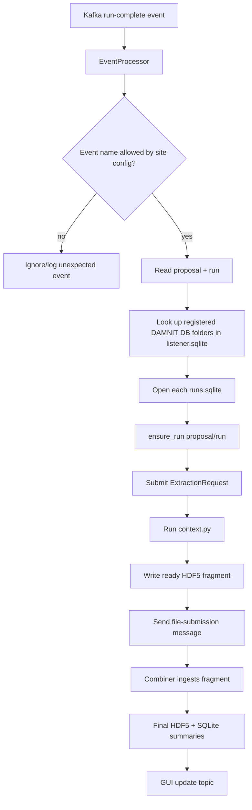
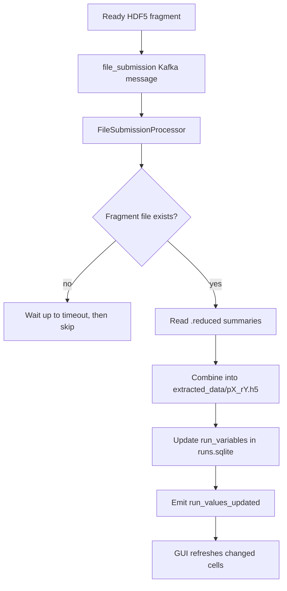
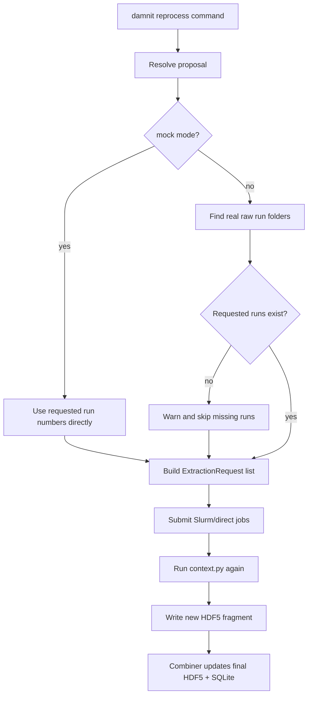
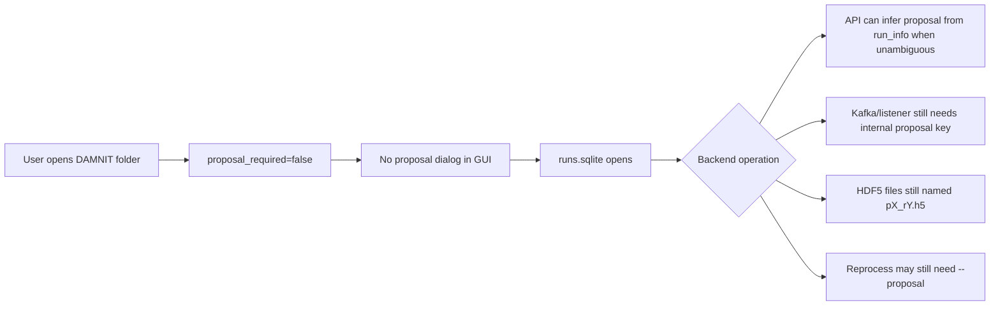
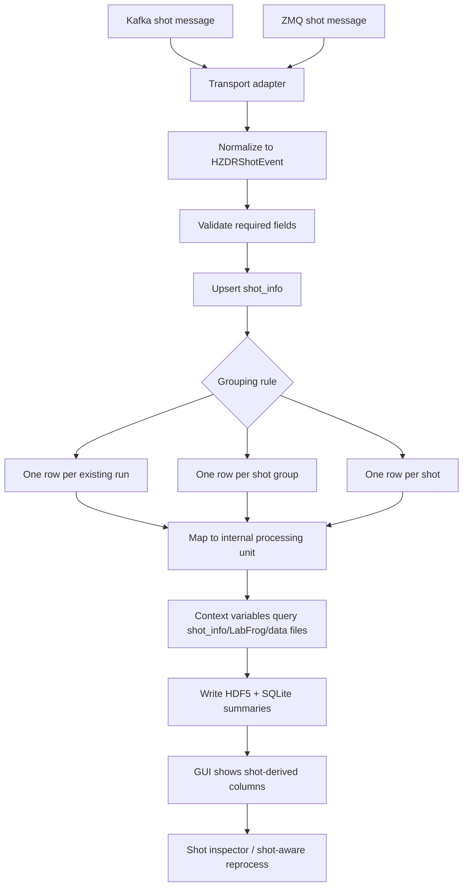

# DAMNIT Data Flow Notes

This document is a practical map of what DAMNIT currently does in this repo,
especially for the HZDR/Kafka/HDF5 questions. It is intentionally written as a
debugging guide rather than architecture theory.

## Short Version

DAMNIT has two related but different flows:

1. A Kafka run-complete message tells DAMNIT that a run exists and should be
   processed.
2. A ready HDF5 fragment tells DAMNIT that extracted variable data has already
   been written and should be combined into the final run HDF5 file and SQLite
   database.

Kafka is normally the trigger/notification layer. HDF5 is where the extracted
data lives.

Reprocessing still needs a proposal and run because the database schema and
HDF5 filenames identify data as `(proposal, run)`, for example:

```text
extracted_data/p1234_r42.h5
```

Even on folder-based HZDR setups where a proposal is less meaningful to the
user, DAMNIT still uses a proposal number internally unless more of the backend
is changed.

For HZDR today, read "no proposal" as:

```text
Users can open/create DAMNIT folders directly without typing a proposal number.
The backend still stores and routes run data using a numeric proposal key.
```

## Flow Diagrams

These diagrams use Mermaid syntax. GitHub, many Markdown previewers, and some
IDEs can render them as actual diagrams.

### Today: Kafka Run Event To DAMNIT Row



### Today: Ready HDF5 Fragment To Database



### Today: Manual Reprocess



### HZDR Today: Folder-First, Internally Keyed



### Proposed: Shot-Based HZDR Ingestion



## Main Pieces

### DAMNIT database directory

A DAMNIT database directory is the working folder that contains:

```text
context.py
runs.sqlite
extracted_data/
process_logs/
```

Important files:

- `runs.sqlite`: stores run rows, variable summaries, comments, metadata, and
  GUI table data.
- `context.py`: defines what variables DAMNIT should calculate for each run.
- `extracted_data/p{proposal}_r{run}.h5`: stores full extracted variable data
  for a run.
- `process_logs/r{run}-p{proposal}.out`: stores processing output for a run.

### Listener database

The listener has its own database:

```text
listener.sqlite
```

This stores which DAMNIT database directories should receive processing jobs for
a proposal. In static mode, the listener will not automatically add official
proposal databases.

## HZDR No-Proposal Mode

HZDR support is currently folder-first, not fully proposal-less.

The important config setting is:

```json
{
  "lab": {
    "name": "HZDR",
    "proposal_required": false
  }
}
```

When `proposal_required` is `false`:

- the GUI can open a DAMNIT database folder directly;
- `initialize_proposal(db_dir, proposal=None)` is allowed for a new database;
- proposal controls can be hidden in the open/new-context dialogs;
- `Damnit(path_to_folder)` can work with folder-based databases.

What this does not fully remove yet:

- `run_info` still stores `proposal` and `run`;
- `run_variables` still stores `proposal` and `run`;
- extracted HDF5 files are still named `p{proposal}_r{run}.h5`;
- Kafka run-complete messages still need a proposal-like numeric key;
- file-submission messages still need `proposal` and `run`;
- manual reprocess still needs a proposal for specific runs unless the command
  is made smarter.

So the safest mental model is:

```text
HZDR no-proposal UI = folder-first user experience
DAMNIT backend      = still proposal/run keyed internally
```

For now, use a stable internal proposal key for HZDR. This can be a real
proposal number if one exists, or a lab/project/run-series number if that is
what HZDR has available. The important part is that the same data source should
use the same key consistently.

### HZDR site config fields

The root `damnit-site.json` and `starter-sites/hzdr-damnit-site/damnit-site.json`
define the HZDR profile. The fields that matter most for flow are:

```json
{
  "profile": "hzdr",
  "lab": {
    "proposal_required": false,
    "data_roots": ["$DAMNIT_HZDR_DATA_ROOT"],
    "data_root_env": "DAMNIT_HZDR_DATA_ROOT",
    "proposal_glob": "{proposal}"
  },
  "listener": {
    "auto_add_official_databases": false,
    "default_profile": "hzdr"
  },
  "kafka": {
    "file_submit_topic": "damnit.file_submissions",
    "listener_profiles": {
      "hzdr": {
        "brokers": ["$DAMNIT_HZDR_KAFKA_BROKER"],
        "topics": ["$DAMNIT_HZDR_KAFKA_TOPIC"],
        "events": ["hzdr_run_complete"]
      }
    }
  }
}
```

Notes:

- `proposal_required: false` controls whether users must provide a proposal
  while creating/opening DB folders.
- `auto_add_official_databases: false` means the listener will not guess an
  official DB path from a proposal. Register database folders explicitly.
- `proposal_glob: "{proposal}"` means if code still asks for a proposal path,
  the data root lookup expects a folder named like the numeric proposal key.
- `damnit_directory_name` differs between configs. A value of `"."` means the
  proposal/project folder itself is the DAMNIT DB. A value like
  `"usr/Shared/amore"` means DAMNIT is under that subfolder.

### HZDR environment file

Local machine-specific values belong in `.damnit.env`, not in code:

```text
DAMNIT_HZDR_DATA_ROOT=C:/data/hzdr
DAMNIT_HZDR_KAFKA_BROKER=kafka.example.org:9092
DAMNIT_HZDR_KAFKA_TOPIC=hzdr.runs
DAMNIT_HZDR_UPDATE_BROKER=kafka.example.org:9092
DAMNIT_CONTEXT_PYTHON=C:/path/to/context/python.exe
DAMNIT_DAMNIT_PYTHON=C:/path/to/damnit/python.exe
```

The checked-in `.damnit.env.example` is the template. Keep secrets and local
paths in `.damnit.env`.

### How to use HZDR folder mode today

For local smoke testing:

```powershell
damnit site-config show
damnit sample-data C:\path\to\damnit-db --proposal 1 --runs 3
damnit gui C:\path\to\damnit-db --no-kafka
```

Why `--proposal 1`? Because sample data still has to write rows and HDF5 files
with an internal proposal key. It does not mean users have to type proposal
numbers in the GUI workflow.

For listener testing with an existing HZDR-style DB:

```powershell
damnit listener add 1 C:\path\to\damnit-db
damnit listener databases
damnit listen C:\path\to\listener-dir
```

Use the same internal key in the Kafka event:

```json
{
  "event": "hzdr_run_complete",
  "proposal": 1,
  "run": 42
}
```

The listener DB currently maps:

```text
internal proposal key -> one or more DAMNIT database folders
```

That is why even HZDR no-proposal mode still needs a key for live processing.
`damnit listen` connects to Kafka using the configured listener profile. For
manual input without Kafka, use the legacy test listener:

```powershell
damnit listen --test
```

## Flow 1: Kafka Run-Complete Event

This is the "a run happened, please process it" flow.

```text
Kafka run-complete message
  -> damnit.backend.listener.EventProcessor
  -> listener checks proposal/run
  -> listener finds registered DAMNIT DB directories for that proposal
  -> listener inserts/updates run_info in runs.sqlite
  -> listener submits an extraction job
  -> extraction job runs context.py
  -> extraction writes a temporary ready HDF5 fragment
  -> combiner ingests that fragment
```

For HZDR, the expected event name is currently:

```text
hzdr_run_complete
```

The listener handler maps this to:

```text
RunData.ALL
```

That means DAMNIT should process variables that need raw and/or processed data.

The Kafka message needs at least:

```json
{
  "event": "hzdr_run_complete",
  "proposal": 1234,
  "run": 42
}
```

For HZDR no-proposal mode, `proposal` currently means the internal routing key,
not necessarily a user-facing proposal. If the real upstream event has no
proposal-like field, add a small adapter or parser that maps the event to:

```json
{
  "event": "hzdr_run_complete",
  "proposal": 1,
  "run": 42
}
```

before it reaches `EventProcessor.handle_event()`.

Current important code:

- `damnit/backend/listener.py`
- `EventProcessor._process_kafka_event()`
- `EventProcessor.handle_hzdr_run_complete()`
- `EventProcessor.handle_event()`

## Flow 2: Ready HDF5 Fragment

This is the "the data has already been extracted, please ingest it" flow.

```text
temporary HDF5 fragment exists
  -> Kafka file-submission message says where it is
  -> damnit.backend.combine.FileSubmissionProcessor
  -> combiner loads reduced summaries from the fragment
  -> combiner combines fragment into extracted_data/p{proposal}_r{run}.h5
  -> combiner updates runs.sqlite
  -> combiner emits a GUI update message
```

A file-submission Kafka message is not a run-complete message. It points to a
specific ready HDF5 file:

```json
{
  "msg_kind": "file_submission",
  "data": {
    "damnit_dir": "C:/path/to/damnit-db",
    "new_file": "C:/path/to/damnit-db/extracted_data/p1234_r42.abc.ready.h5",
    "proposal": 1234,
    "run": 42
  }
}
```

The final combined file becomes:

```text
extracted_data/p1234_r42.h5
```

Current important code:

- `damnit/backend/combine.py`
- `FileSubmissionProcessor.process_file_submission_msg()`
- `gather_all_fragments()`
- `damnit/backend/extract_data.py`
- `file_submit_msg()`
- `notify_new_file()`

## Flow 3: Manual Reprocess

This is the "please run context.py again for existing run numbers" flow.

Example:

```powershell
damnit reprocess --proposal 1234 42
```

What happens:

```text
CLI receives run numbers
  -> damnit.backend.extraction_control.reprocess()
  -> resolves proposal
  -> checks which requested run folders exist on disk
  -> skips missing/inaccessible runs
  -> submits extraction jobs for available runs
```

The confusing part is the disk check. Without `--mock`, DAMNIT does not only
look in `runs.sqlite`. It checks the proposal data folder for raw run
directories like:

```text
raw/r0042
```

If the run folder does not exist or cannot be accessed, DAMNIT prints a warning
and skips it.

For testing without real data folders, use mock mode:

```powershell
damnit reprocess --proposal 1234 --mock 42
```

Mock mode uses a fake run object, so it does not require the real raw data
folder to exist.

For HZDR folder-first databases that do not have `metameta["proposal"]`, these
are the practical options today:

```powershell
damnit reprocess --proposal 1 --mock 42
damnit reprocess --proposal 1 42
damnit reprocess all
```

Use `--mock` when testing context code without real raw data. Use real
reprocess only when the configured data root contains the expected run folder.

If `damnit reprocess all` is used, DAMNIT reads `(proposal, run)` pairs already
stored in the database. That is closer to folder-first behavior, but real
non-mock processing can still skip rows if the run folders are missing.

Current important code:

- `damnit/backend/extraction_control.py`
- `reprocess()`
- `proposal_runs()`
- `ExtractionRequest`
- `ExtractionSubmitter`

## What DAMNIT Touches

During normal processing DAMNIT may read or write:

```text
runs.sqlite
listener.sqlite
context.py
extracted_data/*.h5
process_logs/*.out
.tmp/launch-*.sh
damnit.log
```

During Kafka/listener operation DAMNIT talks to:

```text
Kafka broker configured in damnit-site.json
listener topics configured in damnit-site.json
file-submission topic configured in damnit-site.json
GUI update topic derived from the DB id
```

During real reprocessing DAMNIT reads proposal data directories to decide which
runs exist. The exact root depends on site config:

```text
damnit-site.json
.damnit.env
DAMNIT_SITE_CONFIG
DAMNIT_SITE_ENV
DAMNIT_HZDR_DATA_ROOT
XFEL_DATA_ROOT
```

## Current HZDR Testing Suite

The focused tests for this flow are in:

```text
tests/test_hzdr_data_flow.py
```

They cover:

1. A `hzdr_run_complete` Kafka message records a run and submits extraction.
2. A ready HDF5 fragment is combined into the final run HDF5 file and stored in
   SQLite.
3. Reprocess submits only runs that exist on disk and reports missing runs.

Run them with:

```powershell
uv run --extra test --extra backend python -m pytest tests\test_hzdr_data_flow.py -q -o addopts=""
```

## How To Keep Improving No-Proposal Mode

The no-proposal path is not one change. It is a sequence of small changes that
should each be tested. The safest direction is to keep the current backend
working while moving user-facing workflows toward folder/run identity.

### Step 1: Make the current compatibility explicit

Keep using an internal proposal key, but rename docs/UI/help text where possible
so users see:

```text
data source key
project key
run collection key
```

instead of proposal, when the site config says `proposal_required: false`.

Tests to add or keep:

- opening a folder DB with no configured proposal;
- generating sample data with an explicit internal key;
- reading a run from a DB where `metameta["proposal"]` is absent;
- reprocess messages that explain missing real run folders clearly.

### Step 2: Normalize HZDR incoming events

Define exactly what HZDR sends. If HZDR Kafka messages do not contain
`proposal`, add a small normalization layer:

```text
raw HZDR Kafka event
  -> parse project/folder/run fields
  -> choose internal proposal key
  -> call handle_event(record, normalized_msg, RunData.ALL)
```

This keeps the rest of DAMNIT stable while HZDR event formats evolve.

Good tests:

- event with numeric `proposal`;
- event with only HZDR project/folder id;
- event missing a usable run id;
- event that maps to no registered DB folder.

### Step 3: Improve reprocess for folder-first databases

The current reprocess command still assumes proposal/run identity for specific
runs. A better HZDR behavior would be:

```powershell
damnit reprocess 42
```

inside a folder DB, where DAMNIT resolves the internal key from one of:

1. the only proposal key already present in `run_info`;
2. a new DB setting like `internal_proposal_key`;
3. an HZDR data-source setting in `damnit-site.json`;
4. an explicit `--proposal` fallback when ambiguous.

Good tests:

- one internal key in DB, no `--proposal` needed;
- multiple internal keys in DB, error asks for `--proposal`;
- no key in DB, error explains how to set one;
- `--mock` bypasses real run-folder existence checks.

### Step 4: Decide whether true proposal-less storage is worth it

True proposal-less backend storage would mean changing more than the GUI:

```text
run_info primary identity
run_variables identity
HDF5 naming
API indexing
GUI table model
reprocess CLI
listener routing DB
file-submission messages
migrations for existing DBs
```

That is a larger migration. It may be worth it later, but it is not the lightest
path for getting HZDR testing and operation working now.

The pragmatic path is:

```text
short term: folder-first UI + internal proposal key
medium term: better HZDR event normalization and reprocess defaults
long term: consider true proposal-less DB identity only if the internal key
           keeps causing real operational problems
```

## Shot-Based HZDR Plan

HZDR sounds like it wants to be shot-based rather than proposal/run-based. That
is a bigger shift than hiding proposal fields. It changes the identity DAMNIT
uses to route events, name output files, query metadata, and decide what to
reprocess.

The safest plan is staged:

```text
Phase 0: define the shot event contract
Phase 1: ingest shot events into a side table
Phase 2: group shots into DAMNIT processing units
Phase 3: build Kafka/ZMQ transport adapters
Phase 4: process and display shot-derived data
Phase 5: make reprocess shot-aware
Phase 6: update the GUI around shots
Phase 7: decide on true shot identity
```

### Phase 0: Define the shot event contract

Before writing much code, decide what one upstream event means.

Questions to answer:

- Is one message one shot, one burst, one scan step, or one completed file?
- Does a shot have a stable unique ID?
- Can shots arrive out of order?
- Can the same shot be updated later?
- Does a shot map to a run number at all?
- Does "complete" mean metadata only, detector data ready, HDF5 ready, or all
  of those?
- Are ZMQ and Kafka carrying the same logical event, or different event types?

Recommended normalized event shape:

```json
{
  "event": "hzdr_shot_ready",
  "source": "labfrog",
  "project": "beamtime-2026-04",
  "stream": "laser-a",
  "shot_id": "shot-00000123",
  "shot_index": 123,
  "timestamp": 1777420800.123,
  "data_path": "C:/data/hzdr/beamtime-2026-04/shots/shot-00000123.h5",
  "metadata": {
    "status": "complete"
  }
}
```

Use a normalized internal event even if the real Kafka/ZMQ payload looks
different. Add parser/adapters at the edge:

```text
Kafka raw message -> HZDRShotEvent
ZMQ raw message   -> HZDRShotEvent
```

This keeps the rest of DAMNIT from depending on transport-specific payloads.

### Phase 1: Add shot event storage without breaking runs

Do not start by replacing `run_info`. Add a side table first:

```text
shot_info(
  source,
  project,
  stream,
  shot_id,
  shot_index,
  timestamp,
  data_path,
  status,
  payload_json,
  received_at
)
```

Recommended uniqueness:

```text
(source, project, stream, shot_id)
```

Why side table first:

- existing GUI table stays working;
- existing HDF5 combine flow stays working;
- existing API stays working;
- tests can compare shot records to run-derived outputs;
- rollback is easy if the event contract changes.

Initial code locations:

- new module: `damnit/backend/shot_events.py`
- DB migration: `damnit/backend/db_migrations.py`
- tests: `tests/test_hzdr_shot_events.py`

Minimum tests:

- insert one normalized shot event;
- duplicate event updates or is ignored predictably;
- out-of-order events preserve timestamp and received order;
- invalid events are rejected with useful errors;
- Kafka and ZMQ adapters produce the same normalized event object.

### Phase 2: Choose shot grouping rules

DAMNIT currently processes runs, not individual shots. A shot-based HZDR flow
needs a rule for what becomes one DAMNIT row.

There are three realistic options:

```text
Option A: one DAMNIT row per shot
Option B: one DAMNIT row per group of shots
Option C: one DAMNIT row per existing run, with shot details stored inside it
```

Option A is the most truly shot-based but has the biggest GUI/table impact.
Option B is often the best operational compromise for high-rate shot streams.
Option C is the lowest-risk bridge from current DAMNIT.

Recommended first implementation:

```text
Use Option C or B first.
Keep `run` as an internal processing unit.
Store shot-level details in HDF5 and/or `shot_info`.
```

Example grouping config:

```json
{
  "data_sources": {
    "planned_ingest": {
      "shots": {
        "enabled": true,
        "transport": "kafka",
        "group_by": ["project", "stream"],
        "close_group_after_seconds": 30,
        "max_shots_per_group": 1000
      }
    }
  }
}
```

The grouped processing unit can still use an internal numeric key:

```text
project/stream/date/group -> internal proposal key + internal run number
```

This is not beautiful, but it lets the current backend process shot batches
while the GUI and DB migration work stays bounded.

### Phase 3: Build transport adapters for Kafka and ZMQ

Add a transport-independent interface:

```text
ShotEventSource
  -> KafkaShotEventSource
  -> ZmqShotEventSource
```

The listener should not care whether the event came from Kafka or ZMQ. It should
only receive normalized `HZDRShotEvent` objects.

Suggested package layout:

```text
damnit/backend/shot_events.py
damnit/backend/shot_listener.py
damnit/backend/shot_sources/kafka.py
damnit/backend/shot_sources/zmq.py
```

Kafka is already a dependency through `kafka-python`. ZMQ likely needs an
optional dependency such as `pyzmq`; add it only when the ZMQ listener is
implemented.

Config sketch:

```json
{
  "data_sources": {
    "planned_ingest": {
      "shots": {
        "enabled": true,
        "transport": "kafka",
        "kafka": {
          "brokers": ["$DAMNIT_HZDR_KAFKA_BROKER"],
          "topics": ["$DAMNIT_HZDR_SHOT_TOPIC"]
        },
        "zmq": {
          "endpoint": "$DAMNIT_HZDR_ZMQ_ENDPOINT",
          "mode": "sub",
          "topic": "shots"
        }
      }
    }
  }
}
```

Minimum tests:

- Kafka payload parser handles valid payloads;
- ZMQ payload parser handles valid payloads;
- transport errors do not corrupt the DB;
- reconnect/backoff behavior is bounded and logged;
- malformed messages go to logs or a dead-letter table, not silent failure.

### Phase 4: Process shot data

There are two processing paths to support:

```text
Path 1: event points to data file
Path 2: event only says metadata changed
```

For `Path 1`, the shot listener can create an HDF5 fragment or schedule
context-based extraction. For `Path 2`, it should only update `shot_info` and
let a grouping/reprocess step decide when to calculate variables.

Shot-derived HDF5 layout should preserve shot identity:

```text
extracted_data/p1_r42.h5
  shot/
    ids
    timestamps
    status
  detector/
    mean
    preview
  .reduced/
    shot.count
    detector.mean
```

Context variables can then summarize shots:

```text
shot count
latest shot status
mean signal across shots
failed shot fraction
interactive signal by shot index
detector preview for selected/latest shot
```

The existing HZDR LabFrog context template already points in this direction:

```text
starter-sites/hzdr-damnit-site/context.py
damnit/ctx-templates/HZDR_labfrog.py
```

Those templates query shot documents from MongoDB and reduce them into DAMNIT
variables. Keep improving those as the first user-facing shot workflow.

### Phase 5: Make reprocess shot-aware

Add commands that match the language of the data:

```powershell
damnit shots list
damnit shots ingest --since 2026-04-29T12:00:00
damnit shots reprocess --project beamtime-2026-04 --shot shot-00000123
damnit shots reprocess --project beamtime-2026-04 --range 1000-2000
damnit shots reprocess-group 42
```

Under the hood, these commands can initially resolve to current processing
units:

```text
shot selection -> affected internal run/group IDs -> existing reprocess path
```

Do not force users to know the internal proposal key for shot workflows. Keep
that key as an implementation detail.

Minimum tests:

- list shots from `shot_info`;
- select shots by project/stream/range/time;
- map shots to one processing group;
- map shots to multiple processing groups;
- error clearly when no shots match;
- mock mode works without real data files.

### Phase 6: Update the GUI around shots

Short-term GUI:

- hide proposal controls when `proposal_required: false`;
- rename visible "Proposal" labels to "Source" or hide them in HZDR mode;
- show shot-derived columns from context variables;
- keep the main table grouped by processing unit.

Medium-term GUI:

- add a shot inspector panel for the selected row;
- show shot count, time range, and latest status;
- link from a DAMNIT row to the matching `shot_info` records;
- allow filtering by project, stream, shot status, and time range.

Long-term GUI:

- support a true shot table if users need one row per shot;
- allow reprocessing selected shots directly;
- show event ingestion health for Kafka/ZMQ sources.

### Phase 7: Decide on true shot identity

Only consider replacing `(proposal, run)` after the side-table and grouped-shot
workflow proves insufficient.

Replacing identity means changing:

```text
DB schema and migrations
HDF5 file naming
combine.py
extract_data.py
extraction_control.py
api.py
gui/table.py
gui/process.py
listener routing
file-submission messages
tests and docs
```

Possible future identity:

```text
dataset_id + item_id
```

Where:

```text
dataset_id = project/stream/source
item_id    = shot_id or group_id
```

This is cleaner than forcing everything into proposal/run, but it is a real
backend migration. Do it only after the shot event contract and GUI workflows
are stable.

### Recommended build order

The lowest-risk implementation order is:

1. Define `HZDRShotEvent` and parsers for sample Kafka/ZMQ payloads.
2. Add `shot_info` table and tests.
3. Add a manual `damnit shots ingest-file sample-events.jsonl` command for
   repeatable local testing.
4. Add Kafka shot listener using normalized events.
5. Add ZMQ shot listener after Kafka path is tested.
6. Add grouping rules that map shots to current DAMNIT processing units.
7. Add shot-aware reprocess commands.
8. Improve GUI labels and add a shot inspector.
9. Revisit true shot identity only if grouped processing is not enough.

### First milestone definition

A good first milestone is:

```text
Given a JSONL file of shot events,
DAMNIT can ingest them into shot_info,
show shot-derived context variables in a folder-first HZDR DB,
and reprocess the affected internal group without the user typing proposal.
```

This milestone avoids Kafka/ZMQ reliability work at first, but proves the data
model and user workflow.

## Mental Model

Use this rule of thumb:

```text
Kafka run-complete event = "a run is ready; go process it"
HDF5 ready fragment     = "processed data is ready; ingest this file"
Reprocess command       = "run context.py again for these proposal/run IDs"
```

If DAMNIT says a run does not exist or is not accessible during reprocess, it
usually means the raw run folder check failed, not necessarily that the run is
missing from `runs.sqlite`.

For HZDR specifically:

```text
No-proposal config      = "users work with folders, not proposal dialogs"
Internal proposal key   = "backend compatibility key for routing/storage"
Fully proposal-less     = "future backend migration, not fully done today"
```
